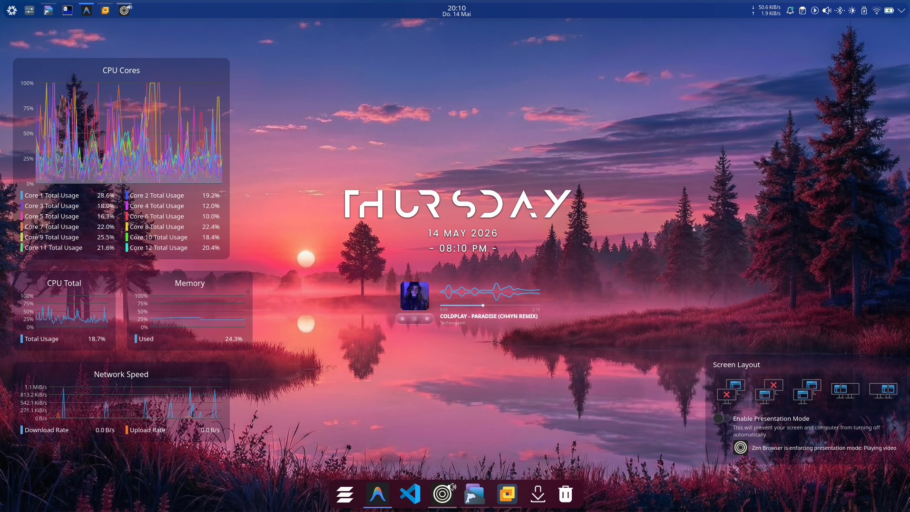
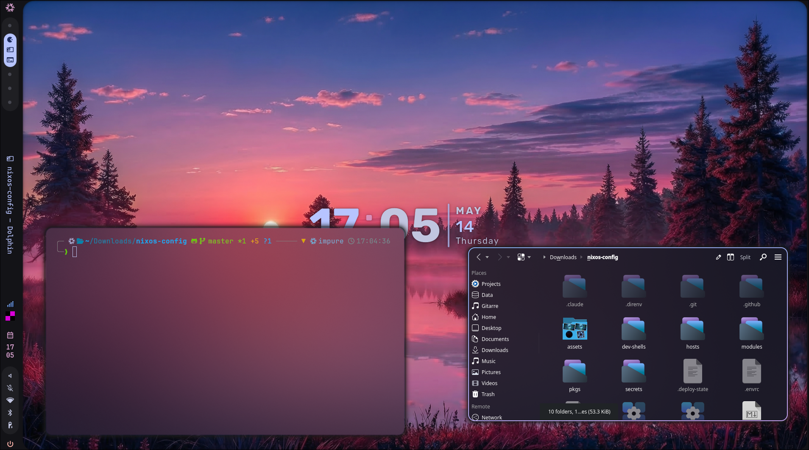
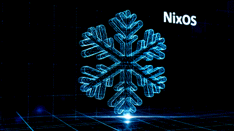
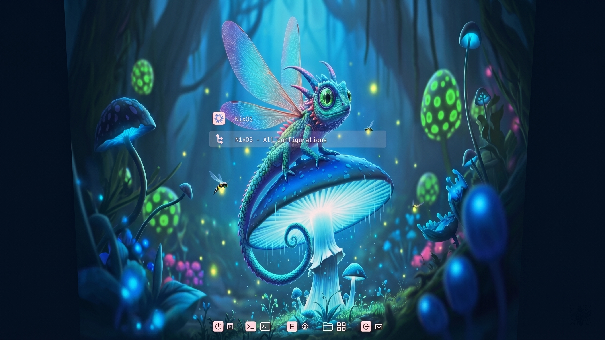
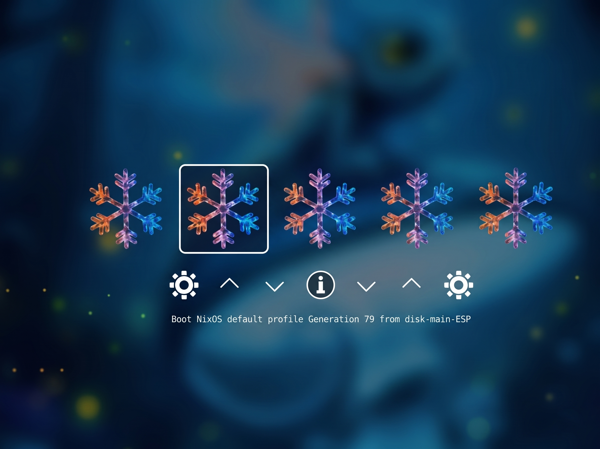

<h1 align="center">
    
   <br>
      
   <br>
      <br>
   <div align="center">


   <div align="center">
      <p></p>
      <div align="center">
         <a href="https://github.com/muddyblack/NixOS/stargazers">
            
         </a>
         <a href="https://github.com/muddyblack/NixOS/forks">
            
         </a>
         <a href="https://nixos.org">
            
         </a>
         <a href="https://github.com/muddyblack/NixOS/blob/master/LICENSE">
            
         </a>
      </div>
      <br>
   </div>
</h1>

## A Note From Me

As previous dual-boot cachyos user I wanted to switch to fully use linux in my daily life. Someone mentioned he started newly using nixos and well here we are. This rice is now built over a period of 5 months until I said it is good and bug free to use.

In the first few weeks, I managed to like break the system three times a day and I was told nixos is not breakable ...  only via live usb the pc was fixable as I edited the hardware-configuration.nix file lol stupid beginner mistake right? And the refind/grub customization caused that too but totally worth it.


---

## Screenshots

**KDE**


**Hyprland**



---

## Boot Animations

> Generate GIFs from the MP4s: `for f in assets/plymouth/*/; do name=$(basename $f); ffmpeg -i "$f$name.mp4" -vf "fps=15,scale=400:-1" "$f$name.gif"; done`

<div align="center">
<table>
<tr>
<td align="center" width="25%"><b>dotted</b><br></td>
<td align="center" width="25%"><b>flower</b><br></td>
<td align="center" width="25%"><b>icy</b><br></td>
<td align="center" width="25%"><b>matrix</b><br></td>
</tr>
</table>
</div>

---

## Bootloaders

**GRUB2**


<br>

**rEFInd**


---

<div align="center">

| | |
|:--|:--|
| **OS** | NixOS 25.11 |
| **WM** | Hyprland · KDE Plasma 6 |
| **Shell** | Zsh · Powerlevel10k |
| **Terminal** | Ghostty |
| **Bar** | Caelestia Shell |
| **Browser** | Zen Browser |
| **Editor** | Neovim (LazyVim) · Antigravity · Zed |
| **File Manager** | Yazi · Dolphin |
| **Theme** | Sweet Dark · Kvantum |
| **Icons** | Papirus-Dark · Slot-Dark · Vivid-Dark |
| **Cursor** | Sweet Cursors |
| **Login** | SDDM · Sonomatic |
| **Boot** | Plymouth · custom MP4 themes |
| **Disk** | Btrfs · LUKS · Impermanence |

</div>

---

## Structure

```
NixOS/
├── flake.nix
├── deploy.sh                    # Install & rebuild helper
├── hosts/
│   ├── common.nix               # Shared system config
│   ├── disko-config.nix         # Disk layout (LUKS + Btrfs)
│   ├── muddyblack/              # Full desktop
│   └── muddyblack-lite/         # Lightweight (VM / testing)
├── modules/
│   ├── nixos/                   # System-level modules & features
│   └── home-manager/            # User environment
├── pkgs/                        # Custom packages & overlays
├── assets/                      # Wallpapers, sounds, themes, icons
└── dev-shells/                  # Language dev environment templates
```

---

## Install

> No `hardware-configuration.nix` in this repo — disks are partitioned at install time via Disko. You can install on a running system or from the [NixOS minimal ISO](https://nixos.org/download).

**Disk layout** — the disko config works on any drive. `deploy.sh` will prompt you for your disk device (e.g. `/dev/sda`, `/dev/nvme0n1`) or you can pass `--device` to skip the prompt. Partition sizes for dual-boot (`--win-size`, `--shared-size`) are also configurable — see `bash deploy.sh help` for all flags.

<details>
<summary>Try in a VM first (from any machine with Nix)</summary>

```bash
nix build .#nixosConfigurations.muddyblack-lite.config.system.build.vm
./result/bin/run-muddyblack-lite-vm
```

</details>

<details>
<summary>Fresh install from a live ISO</summary>

```bash
sudo su
git clone https://github.com/Muddyblack/NixOS /mnt/NixOS
cd /mnt/NixOS
bash deploy.sh fresh                          # prompts for disk device
# or: bash deploy.sh fresh --device /dev/nvme0n1 --no-dual-boot
```

</details>

<details>
<summary>Remote install via nixos-anywhere</summary>

```bash
git clone https://github.com/Muddyblack/NixOS
cd NixOS
bash deploy.sh fresh --remote root@<ip> --device /dev/sda
```

</details>

**Day-to-day rebuild:**
```bash
upnix
```

**KDE only or Hyprland only:** Both WMs are configured by default and switchable at the login screen. Remove the one you don't want from [`modules/home-manager/home.nix`](modules/home-manager/home.nix):

```nix
./plasma-settings.nix   # KDE Plasma
./hyprland.nix          # Hyprland
```

---

## Shell & Tools

Powered by **Zsh** + **Powerlevel10k**, with modern CLI replacements throughout:

| Tool | Replaces | Notes |
|:--|:--|:--|
| `zoxide` | `cd` | Frecency-based directory jumping |
| `eza` | `ls` | Icons, git info; auto-runs on `cd` |
| `yazi` | file manager | Terminal file browser |
| `fzf` + `fzf-tab` | tab completion | Fuzzy completions + history search |
| `ripgrep` | `grep` | Aliased as `grep` |
| `fd` | `find` | Aliased as `find` |
| `btop` | `top` | Aliased as `top` |
| `gping` | `ping` | Graphical, aliased as `ping` |
| `xh` | `curl` | Aliased as `curl` |

Reconfigure the prompt:
```bash
p10k configure
```

---

## Usage

**Generations & rollback:**
```bash
gen           # list all generations
rollback N    # switch to generation N
gcnix         # garbage collect (keeps last 5 generations)
```

<details>
<summary>All key aliases</summary>

| Command | Does |
|:--|:--|
| `upnix` | Rebuild & switch (plays sound on done) |
| `update` | `nix flake update` |
| `gen` | List NixOS generations |
| `rollback N` | Roll back to generation N |
| `gcnix` | Garbage collect |
| `ll` | `eza` with icons & git info |
| `vim` | `nvim` |
| `top` | `btop` |
| `grep` | `ripgrep` |
| `find` | `fd` |
| `ping` | `gping` (graphical) |
| `curl` | `xh` |
| `lg` | `lazygit` |
| `gs` `ga` `gc` `gp` | git status / add / commit / push |

</details>

<details>
<summary>Keybindings (Hyprland)</summary>

| Shortcut | Action |
|:--|:--|
| `Super + Return` | Terminal (Ghostty) |
| `Super + E` | File manager (Dolphin) |
| `Super + Q` | Close window |
| `Super + F` | Fullscreen |
| `Super + Shift + S` | Screenshot (region) |
| `Super + 1-9` | Switch workspace |
| `Super + Shift + 1-9` | Move window to workspace |
| `Super + −` | Toggle special workspace |

</details>

**KDE Plasma layout:**

Desktop widgets and panel layout are managed by [plasma-manager](https://github.com/nix-community/plasma-manager) via [`modules/home-manager/plasma-settings.nix`](modules/home-manager/plasma-settings.nix). After editing and running `upnix`, Plasma needs a layout rebuild to pick up changes:

```bash
systemctl --user start plasma-layout-rebuild
```

> This backs up your current layout, wipes Plasma's cache, and re-applies everything from config. Use it whenever widgets drift or don't appear after a rebuild.

---

## AI Integration

Local and cloud AI coding assistants are pre-configured and ready after a rebuild.

### Cloud (fast, recommended for daily use)

```bash
cc-gemini          # Claude Code → Gemini 2.5 Pro (requires GEMINI_API_KEY)
cc-openrouter      # Claude Code → OpenRouter (requires OPENROUTER_API_KEY)
oc                 # OpenCode (auto-configured to local Ollama)
```

### Local (offline / private)

[Ollama](https://ollama.com) runs as a system service. Models are **not** downloaded automatically — pull once on first use:

```bash
ai-pull            # download default model (gemma4:4b, ~3-4 GB)
ai-pull <model>    # download any other Ollama model
ai-models          # list locally installed models
```

Then launch:

```bash
cc-ollama                    # Claude Code → local Gemma 4 4B
cc-ollama qwen2.5-coder:7b   # Claude Code → a different local model
oc                           # OpenCode → same local model
ai-webui                     # Open WebUI (ChatGPT-style browser frontend)
ai-webui-stop                # Stop the WebUI to free its ~300 MB RAM
```

> **Performance note:** CPU-only (no dedicated GPU) runs at ~4-15 tok/s depending on model size and CPU generation. The 4B model is the sweet spot for usability. Use cloud backends for latency-sensitive work.

### Model recommendations for CPU-only

| Model | Size | Speed (i5-13420H) | Best for |
|:--|:--|:--|:--|
| `gemma4:e4b` | ~9 GB | ~10-15 tok/s | Default, general use (MoE) |
| `gemma4:e2b` | ~5 GB | ~20+ tok/s | Fast replies, weaker reasoning |
| `qwen2.5-coder:7b` | ~5 GB | ~6-10 tok/s | Coding-focused tasks |
| `gemma4:26b` | ~17 GB | ~2-4 tok/s | Higher quality, slow |

---

## Secrets

Personal secrets (e.g. the `:mail` espanso snippet) are stored encrypted in `secrets/secrets.yaml` via [sops-nix](https://github.com/Mic92/sops-nix). SOPS is **opt-in** — set `features.sops.enable = false` if you don't need it; forks build fine without it.

<details>
<summary>First-time setup on a new machine</summary>

One command generates your age key, updates `.sops.yaml`, and opens the editor:

```bash
./deploy.sh sops-setup
```

Add your secrets (see `secrets/secrets.yaml.example` for the schema), then enable and rebuild:

```nix
features.sops.enable = true;
```
```bash
upnix
```

</details>

<details>
<summary>Day-to-day secret management</summary>

```bash
secrets edit    # edit encrypted secrets
secrets rotate  # re-encrypt after adding a new key to .sops.yaml
```

Adding a new secret:
1. `secrets edit` → add a key
2. Declare it in `modules/nixos/features/sops.nix`:
   ```nix
   sops.secrets.my-secret = { owner = username; mode = "0400"; };
   ```
3. Reference as a file path: `/run/secrets/my-secret`

</details>

---

## Credits

<div align="center">

| Project | Author |
|:--|:--|
| [Caelestia Shell](https://github.com/caelestia-dots/shell) | caelestia-dots |
| [Sweet Theme & Cursors](https://github.com/EliverLara/Sweet) | EliverLara |
| [Sonomatic SDDM](https://www.opencode.net/phob1an/sonomatic) | phob1an |
| [Illusion Plymouth Splash](https://github.com/dgudim/themes) | dgudim |
| Boot Animations (Google Veo) | Google DeepMind |
| [Vivid Plasma Themes](https://github.com/L4ki/Vivid-Plasma-Themes) | L4ki |
| [Slot Icon Theme](https://github.com/L4ki/Slot-Plasma-Themes) | L4ki |
| [Colorful Icon Theme](https://github.com/L4ki/Colorful-Plasma-Themes) | L4ki |
| [Iridescent Plasma Style](https://github.com/ddh4r4m/Iridescent) | ddh4r4m |
| [Utterly Round Plasma Style](https://github.com/HimDek/Utterly-Round-Plasma-Style) | HimDek |
| [Overview Widget](https://github.com/HimDek/Overview-Widget-for-Plasma) | HimDek |
| [Modern Clock Widget](https://github.com/prayag2/kde_modernclock) | prayag2 |
| [Netspeed Widget](https://github.com/dfaust/plasma-applet-netspeed-widget) | dfaust |
| [Plasma Audio Visualizer](https://github.com/Muddyblack/plasma-audio-visualizer) | muddyblack |
| [Audio Wave Widget](https://github.com/zayronxio/Audio-Wave-Widget) | zayronxio (inspiration) |
| [Grub2 Themes](https://github.com/vinceliuice/grub2-themes) | vinceliuice |
| [rEFInd Theme](https://github.com/evanpurkhiser/rEFInd-minimal) | evanpurkhiser |
| [Sly-Harvey/NixOS](https://github.com/Sly-Harvey/NixOS) | Sly-Harvey |
| [home-manager](https://github.com/nix-community/home-manager) | nix-community |
| [disko](https://github.com/nix-community/disko) | nix-community |
| [impermanence](https://github.com/nix-community/impermanence) | nix-community |
| [sops-nix](https://github.com/Mic92/sops-nix) | Mic92 |
| [plasma-manager](https://github.com/nix-community/plasma-manager) | nix-community |

</div>
